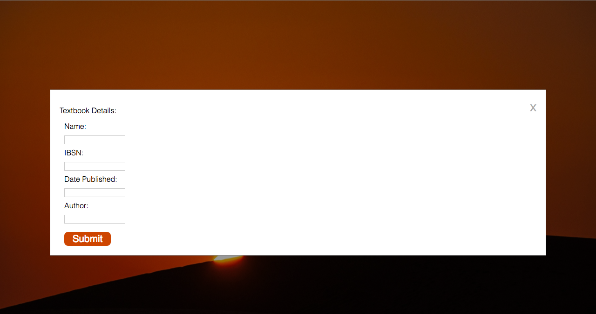

# JavaScript Modals
------------
Disclaimer:

The image used in the webpage was found on www.pixabay.com where the images are available under creative commons.
I once again, am using the photo for educational purposes.

------------
Using JavaScript, I was able to manipulate html elements to produce modals, when a button was clicked.

I animated the modals in when the user clicked on the buttons on the html page using CSS.

I created the modals in the context of a landing page of a textbook website, to test my web design skills as well.

I should note, that as my projects increase in size, I must not embed three languages in one HTML page, as it becomes very large in terms of the number of lines and organization of the three languages. Seperate files is more ideal for code organization. Future larger Projects will work with more files.

When the user arrives at the website, it should look like this: 

But as the user clicks on either button, it should look like this (FYI: the style is the same for both modals):

